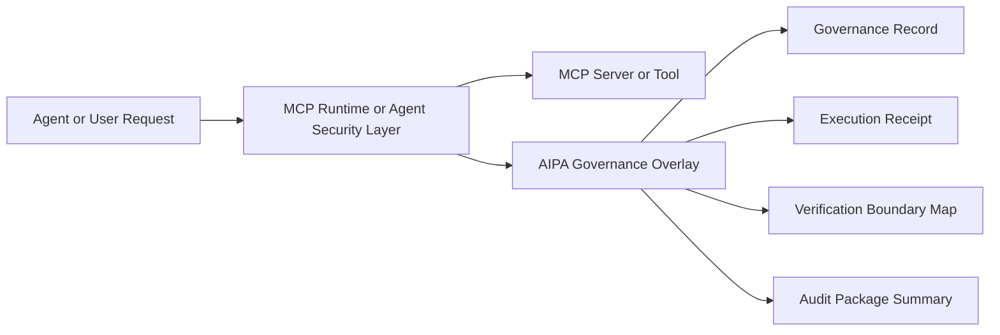
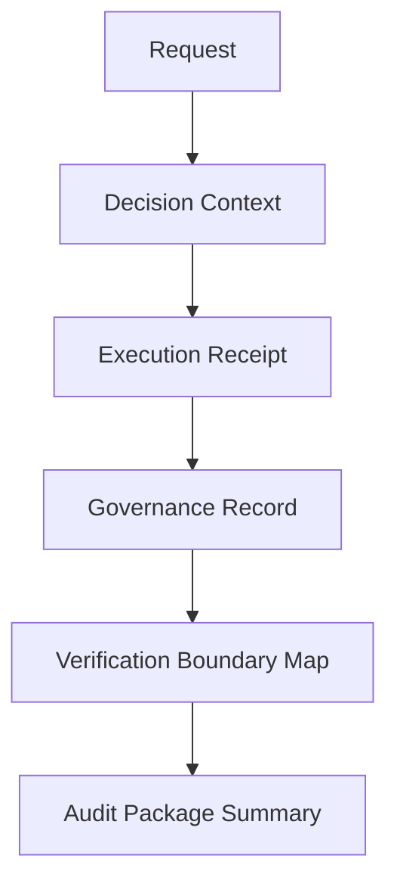
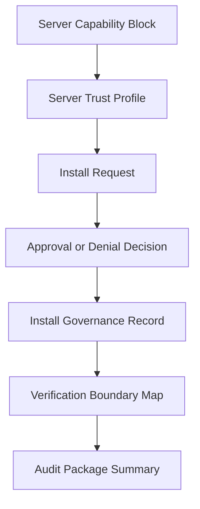
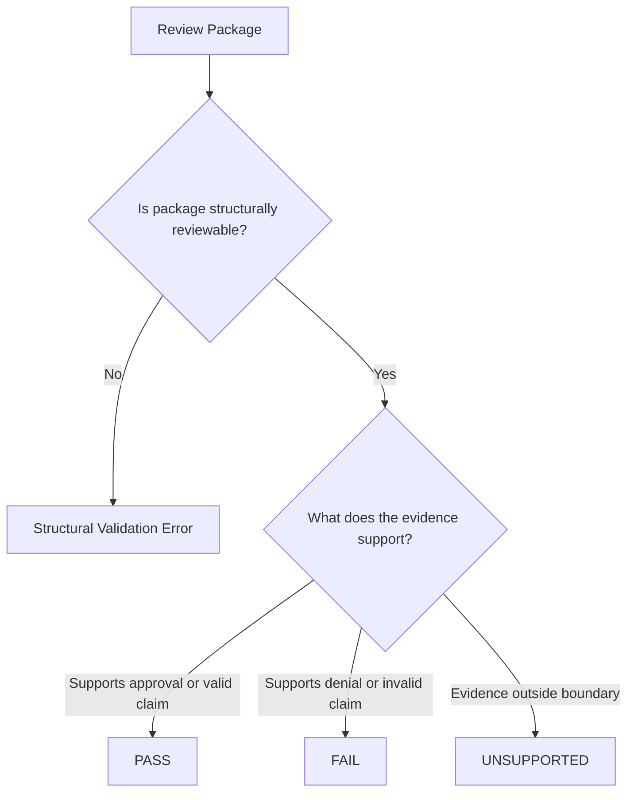
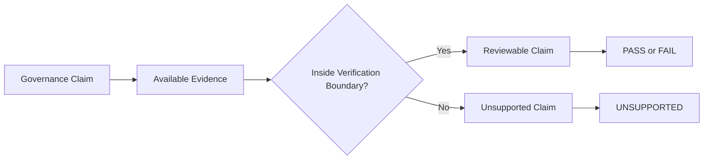
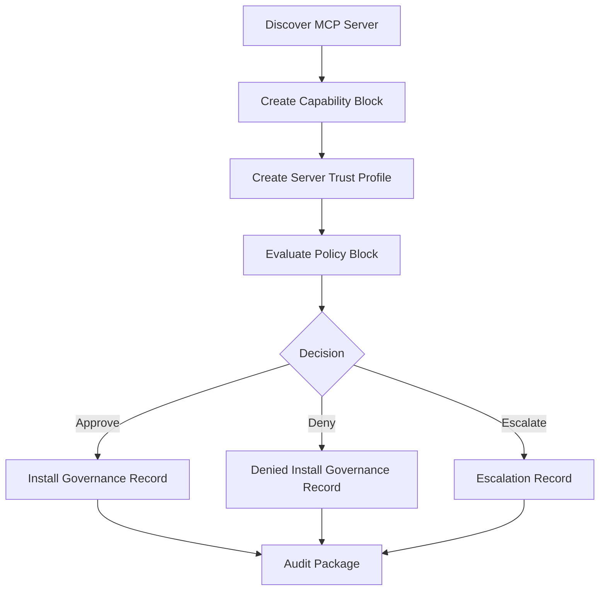
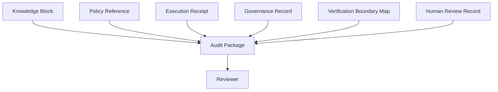
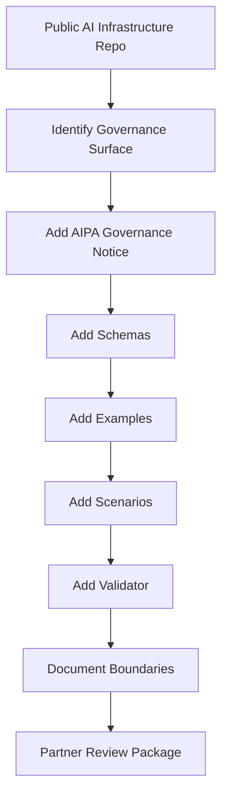

# AIPA MCP Governance Overlay Architecture Diagrams

This document provides simple architecture diagrams for the AIPA MCP governance research overlay.

The diagrams are explanatory. They do not claim official integration, runtime enforcement, certification, attestation, or endorsement.

## 1. Runtime layer versus governance layer

MCP-style runtime and security systems control operational behavior.

AIPA governance artifacts explain the decision context around that behavior.



Key point:

```text
Runtime controls execution.
Governance records explain review context.
```

## 2. Governance artifact flow

This is the general artifact flow used across the v0.1 scenario packages.



In server lifecycle scenarios, the flow may include server-specific artifacts.



## 3. PASS, FAIL, and UNSUPPORTED outcomes

The overlay separates structural validity from governance outcome.



Key point:

```text
A FAIL governance outcome does not mean the scenario files are broken.
It means the evidence supports denial or failure of the governance request.
```

## 4. Verification boundary model

Governance records can declare claims.

Verification boundary maps identify which claims are reviewable with available evidence.



The boundary prevents the system from claiming more certainty than the evidence supports.

## 5. Server install governance lifecycle

This diagram shows how a server install or exposure decision can be represented as a governance package.



Key point:

```text
Approval, denial, and escalation can all be represented as governance outcomes.
```

## 6. External verifier handoff concept

AIPA governance artifacts can package evidence for an independent verifier without requiring the verifier to trust the originating governance layer.


This supports a separation between:

```text
governance declaration
```

and:

```text
independent verification
```

## 7. Audit package composition

Audit packages summarize related artifacts so reviewers do not need to reconstruct the chain manually.



## 8. Reusable overlay pattern

The AIPA overlay pattern can be reused across compatible public repositories when the positioning is partner-safe and non-competitive.



## Diagram summary

The architecture can be summarized as:

```text
Runtime systems execute.
Governance artifacts explain.
Verification boundaries constrain certainty.
Audit packages make review practical.
```

That is the core architectural position of the AIPA MCP governance research overlay.
